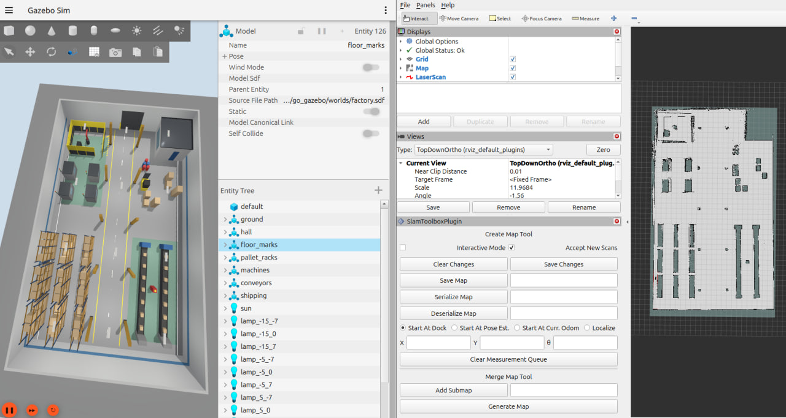
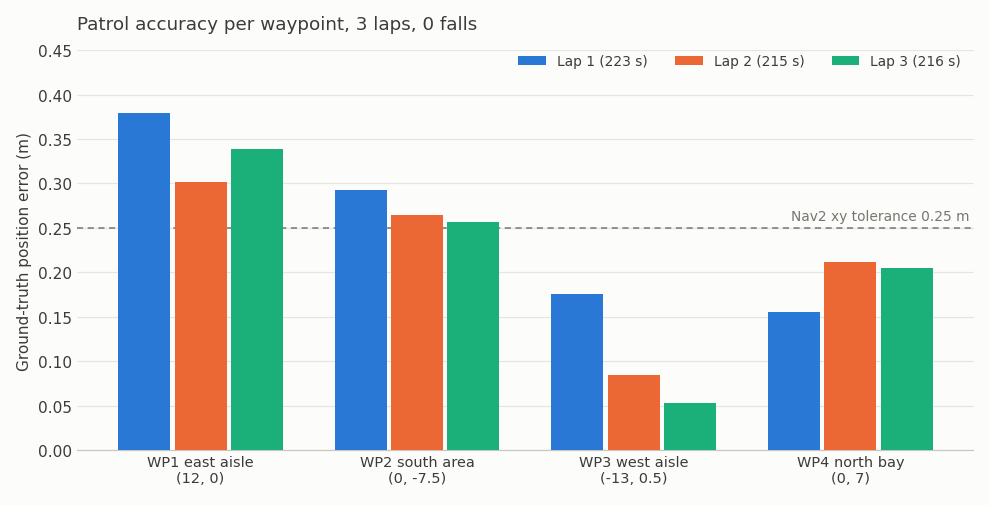

# Quadruped-RL

A reinforcement-learning walking policy for the **Unitree Go1**, trained in **MuJoCo Playground** and deployed in **ROS 2 Jazzy + Gazebo Harmonic**, where it walks under a joystick and patrols a factory with **Nav2**, avoiding obstacles it has never seen.



The policy is *blind*: it only turns a velocity command (vx, vy, yaw rate) into joint targets. Everything that needs perception (mapping, localisation, planning, obstacle avoidance) is done by the ROS 2 navigation stack on top of it.

## What works

| Stage | Status |
|---|---|
| Train a joystick policy in MuJoCo Playground (Brax PPO) | ✅ [`locomotion.ipynb`](locomotion.ipynb) → `Joystick_model/` |
| Export the trained MuJoCo model to URDF + meshes + gains | ✅ `src/tools/mjcf_to_urdf.py` |
| Robot stands and walks in Gazebo (NumPy policy at 50 Hz, PD at 500 Hz) | ✅ |
| Keyboard and gamepad driving through `twist_mux` with a deadman button | ✅ |
| SLAM map of a 40 × 24 m factory hall (`slam_toolbox`) | ✅ `maps/factory.*` |
| Nav2 drives to a single goal | ✅ `goto` |
| Patrol loop of waypoints, with per-waypoint logging and fall recovery | ✅ `patrol`: 3 laps, 12/12 waypoints, 0 falls |
| Live avoidance of obstacles that are not on the map | ✅ static obstacles · ⚠️ moving obstacles (see [limits](#known-limitations)) |



Full numbers and plots: **[docs/results.md](docs/results.md)**.

## Quick start

Requirements: Ubuntu 24.04, ROS 2 Jazzy, Gazebo Harmonic (full list in [docs/installation.md](docs/installation.md)).

```bash
# build
cd ~/Quadruped-RL
rosdep install --from-paths src --ignore-src -y
colcon build --symlink-install
source install/setup.bash
```

Each command in its own terminal (source `install/setup.bash` in each). Stop with **Ctrl‑C**, not Ctrl‑Z.

```bash
# T1: Gazebo + robot + walking policy + joystick/twist_mux     (gui:=false for headless)
ros2 launch go_navigation bringup.launch.py

# T2: map server + AMCL + Nav2 + RViz on the factory map
ros2 launch go_navigation navigation.launch.py

# T3: pick one
ros2 run go_navigation goto 6 0                         # one goal
ros2 run go_navigation patrol --ros-args -p laps:=3     # patrol loop
ros2 run go_navigation obstacles scenario aisle         # drop new obstacles while it patrols
```

Driving by hand instead: hold **LB** on a gamepad, or
`ros2 run teleop_twist_keyboard teleop_twist_keyboard --ros-args -r cmd_vel:=cmd_vel_key` (hold the keys).

## Architecture

```text
 Gamepad ─ joy_node ─ teleop_twist_joy ─ /cmd_vel_joy (prio 100) ─┐
 Keyboard ─ teleop_twist_keyboard ───── /cmd_vel_key (prio  90) ──┼─ twist_mux ─ /cmd_vel_mux
 Nav2 (MPPI ─ velocity_smoother ─ collision_monitor) ─ /cmd_vel (prio 10) ─┘          │
   ▲ /scan, map→odom (AMCL), odom→base_link (odom_tf)                               ▼
   │                                                          policy_node (50 Hz, NumPy MLP)
   │                                                                     │ /policy/q_target
 Gazebo ◄── /effort_controller/commands ◄── pd_controller (500 Hz): τ = Kp(q* − q) − Kd·q̇
   └─► /joint_states /imu /scan /odom /clock  (ros2_control + ros_gz_bridge)
```

Details: [docs/architecture.md](docs/architecture.md).

## Repository layout

```text
Quadruped-RL/
├── Joystick_model/          trained policy artefacts from Colab (Brax params, env + PPO config)
├── docs/                    documentation and result images
├── src/
│   ├── go_description/      URDF, STL meshes, robot_params.yaml (joint order, gains, default pose)
│   ├── go_gazebo/           worlds (factory, patrol_room), sim launch, ros2_control config
│   ├── policy_node/         policy_node, pd_controller, odom_tf, policy_weights.npz
│   ├── go_navigation/       teleop, SLAM, Nav2 params, maps, goto / patrol / obstacles / reset_robot
│   └── tools/               exporter, policy converter, world generator (not ROS packages)
└── locomotion.ipynb         Colab training notebook (MuJoCo Playground + Brax PPO)
```

## Documentation

| Document | Contents |
|---|---|
| [Installation](docs/installation.md) | ROS 2 / Gazebo packages, Python venv, build |
| [Architecture](docs/architecture.md) | Nodes, topics, frames, packages, design decisions |
| [Training and export](docs/training.md) | Colab notebook, training configuration, observation layout, policy export, URDF export |
| [Simulation and teleop](docs/simulation.md) | Bringing the robot up in Gazebo, standing, keyboard and joystick |
| [Navigation](docs/navigation.md) | Mapping, localisation, single goals, patrol, live obstacles, tuning speed |
| [Results](docs/results.md) | Measured performance, plots, policy evaluation |
| [Troubleshooting](docs/troubleshooting.md) | Symptoms, causes, fixes |
| [Original build guide](docs/quadruped_ros2_gazebo_nav_guide.md) | The step-by-step guide this project followed |

## Known limitations

- **Ground-truth odometry.** Nav2 uses Gazebo's perfect odometry, so navigation looks better than it would on hardware.
- **Moving obstacles.** Nav2's costmaps react to where obstacles *are*, not where they are going; a crossing obstacle touched the robot once in testing.
- **Policy deadzone.** The policy ignores commands below about 0.15 m/s forward and 0.3 rad/s turning; the Nav2 tuning works around this (see [navigation](docs/navigation.md#why-the-mppi-accelerations-are-so-high)).
- **Flat floor only.** The policy was trained on flat terrain; obstacles lower than the lidar plane (~0.39 m) are invisible to Nav2.
- **Sim-to-sim gap.** Gazebo (DART) is not MuJoCo; gains in Gazebo differ from training (see [training](docs/training.md#gazebo-vs-training-gains)).

## License

[MIT](LICENSE). The Go1 meshes and model come from [MuJoCo Menagerie](https://github.com/google-deepmind/mujoco_menagerie) (BSD-3-Clause).
