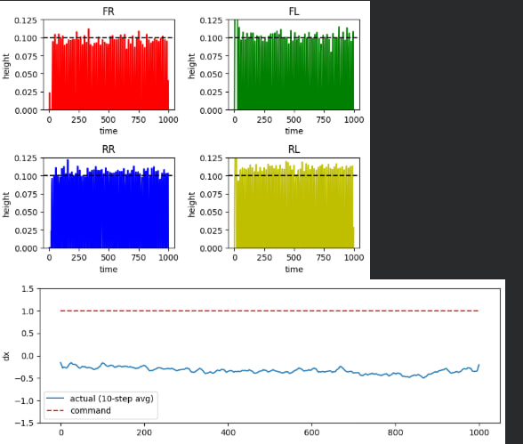
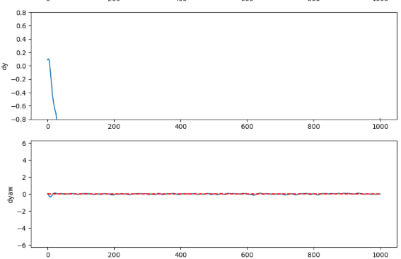

# Training and export

The policy was trained in Google Colab with **MuJoCo Playground** (Go1 joystick task, flat terrain) and **Brax PPO**, then converted to a NumPy file so the ROS node needs no JAX.

## Artefacts in `Joystick_model/`

| File | What it is |
|---|---|
| `env_config.json` | Environment config used for training (control rate, gains, command range, rewards, noise) |
| `ppo_params.json` | PPO hyper-parameters and network sizes |
| `joystick_params.pkl` | Trained Brax parameters (observation normaliser + policy + value) — input to `export_policy.py` |
| `final_params.pkl` | Brax training checkpoint saved at the end of the run |

The deployed policy is `src/policy_node/config/policy_weights.npz`, produced from `joystick_params.pkl`.

## Training configuration

| Setting | Value |
|---|---|
| Physics / control step | `sim_dt` 0.004 s / `ctrl_dt` 0.02 s (50 Hz policy) |
| Actuators | position, Kp 35, Kd 0.5, `action_scale` 0.5 around the home pose |
| Command range | vx ±1.5 m/s, vy ±0.8 m/s, wz ±1.2 rad/s (`command_config.a`) |
| Episode | 1000 steps (20 s) |
| PPO | 200 M env steps, 8192 envs, batch 256, 32 minibatches, 4 updates/batch, unroll 20, γ 0.97, lr 3e‑4, entropy 0.01 |
| Networks | policy and value MLPs 512‑256‑128; value uses the privileged state |
| Observation noise | gyro 0.2, gravity 0.05, joint pos 0.03, joint vel 1.5, linvel 0.1 |
| Perturbation kicks | disabled |

Main reward terms: `tracking_lin_vel` 1.0, `tracking_ang_vel` 0.5, `pose` 0.5, `feet_air_time` 0.1, `orientation` −5.0, `feet_clearance` −2.0, `stand_still` −1.0, `lin_vel_z` −0.5, `max_foot_height` 0.1 m. The full list is in `env_config.json`.

## Policy network as deployed

`policy_node` re-implements the Brax inference in NumPy:

```text
obs (48) → normalise (mean/std from training) → 512 → 256 → 128 (SiLU) → 24 outputs
action = tanh(outputs[:12])                       # deterministic mean, std head ignored
q_target = default_q + action_scale * action      # published on /policy/q_target
```

Observation layout (inferred from the saved normaliser and the Playground Go1 joystick env):

| Index | Quantity | Source in ROS |
|---|---|---|
| 0–2 | base linear velocity (body frame) | `/odom` twist (ground truth) |
| 3–5 | gyro | `/imu` |
| 6–8 | gravity in body frame, Rᵀ·(0, 0, −1) | `/imu` orientation |
| 9–20 | joint position − default pose | `/joint_states` (mapped by name) |
| 21–32 | joint velocity | `/joint_states` |
| 33–44 | last action | internal |
| 45–47 | command (vx, vy, wz), clipped to the training range | `/cmd_vel_mux` |

## Evaluation in MuJoCo

The two plots below come from one evaluation rollout in Colab (1000 steps).





- **Foot heights:** all four feet reach ~0.10 m swing height, matching `max_foot_height` 0.1, with a regular gait on every leg.
- **Yaw rate:** follows the command (0) closely.
- **vx and vy in this rollout do not track the command:** with vx commanded at 1.0 m/s the 10‑step average stays near −0.3 m/s, and vy drifts beyond −0.8. The robot does walk forward correctly in Gazebo, so this rollout is more likely affected by the velocity frame or sign used in the plotting cell than by the policy. **Re-check the evaluation code before quoting these numbers.**

## Converting a new policy

Run in the training venv (needs JAX/Brax to unpickle):

```bash
python src/tools/export_policy.py Joystick_model/joystick_params.pkl \
       src/policy_node/config/policy_weights.npz
```

It writes `obs_mean`, `obs_std` and the four layers `W0..W3`, `b0..b3`.

## Exporting the robot model

```bash
python src/tools/mjcf_to_urdf.py mujoco_menagerie/unitree_go1/go1.xml \
       --out src/go_description --name go1 --flavor harmonic       # or --flavor fortress
```

or from Python on the exact training model:

```python
from mujoco_playground import registry
from mjcf_to_urdf import export_urdf
env = registry.load("Go1JoystickFlatTerrain")
export_urdf(env.mj_model, "src/go_description", robot_name="go1", flavor="harmonic")
```

It writes `urdf/go1.urdf`, recentred `meshes/*.stl` and `config/robot_params.yaml` (joint order, default pose, gains, torque limits). `action_scale` has to be filled in by hand from `env_config.json`.

**Verify the export:** `src/tools/check_urdf.py` reloads the URDF in MuJoCo and prints the centre-of-mass error of every link against the original (expect ~1e‑15). Edit the two absolute paths at the top of the script first.

## Gazebo vs training gains

The two parameter files in `go_description/config` are used by different nodes:

| File | Used by | Kp | Kd (PD node) |
|---|---|---|---|
| `robot_params.yaml` | `policy_node` (joint order, default pose, action scale) | 35 | 0 |
| `robot_standing_params.yaml` | `pd_controller` (default) | 25 front / 35 rear | 1.6 front / 1.1 rear |

The URDF additionally sets joint damping 0.5 and friction 0.3 (hip, thigh) / 1.0 (calf). These values were tuned so the robot stands and walks in Gazebo; they differ from training (Kp 35, Kd 0.5, `sim_dt` 0.004 vs Gazebo's 0.002). That difference is part of the sim-to-sim gap, along with Gazebo's DART physics, missing armature and frictionloss, and the ROS loop latency.
